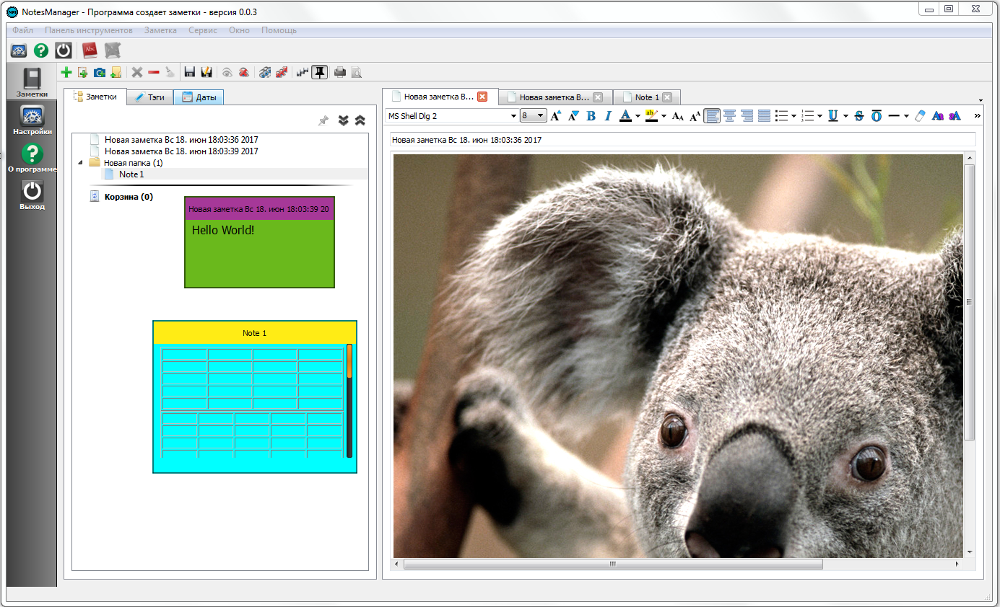

NotesManager 0.0.3 (Qt 4.8)
============

Это моя дипломная работа на которую потратил чуть больше года.

За время написания менеджера я буквально жил им: постоянно им занимался, думал о нем.

Но в нем есть несколько недостатков, которые я не хотел видеть:
1. отсутствие поиска заметок
2. замечен был баг, из-за которого портился файл notebook.xml, из-за чего менеджер терял информацию заметках, хотя они лежали в его папке.
3. сейчас я бы не стал заметки размещать в папке на диске, а хранил бы в базе данных, например sqlite.

##

В архиве [bin.rar](bin.rar) разместил скомпилированный код вместе с dll и заметками.

##

Эта версия урезанная дипломная:
1. Удалил дополнительные модули: qtsingleapplication, quazip и QScintilla
2. Удалил скриптовый модуль -- не нужен
3. Удалил папку с документацией по коду

Теперь проблем с сборкой и запуском не будет, благодаря действиям в первом пункте.
Скриптовый модуль был просто игрушкой, так же как и документация, которая к тому же 45мб занимала :)

Текущая сборка в архиве [bin.rar](bin.rar) разместил скомпилированный код вместе с dll и заметками.

В любом случае, предыдущий исходный код будет сохранен в репозитории в [другой ветке](https://github.com/gil9red/NotesManager/tree/old_master).

А сама дипломная сборка находится тут: https://github.com/gil9red/NotesManager/releases/tag/0.0.3

##

